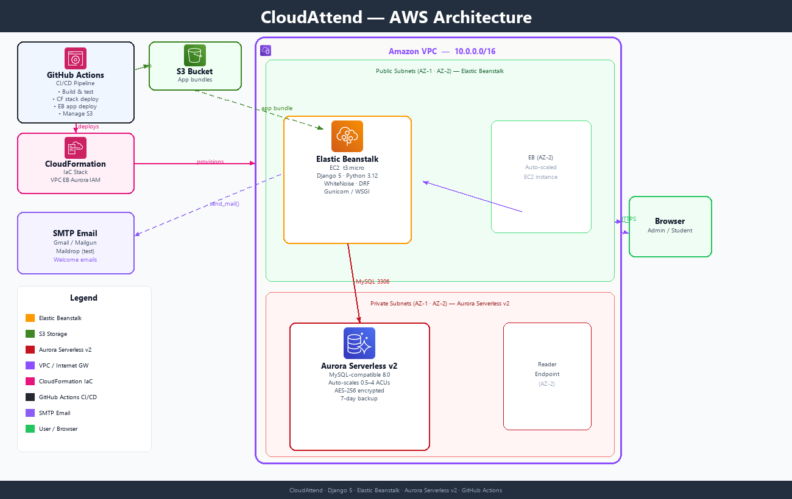
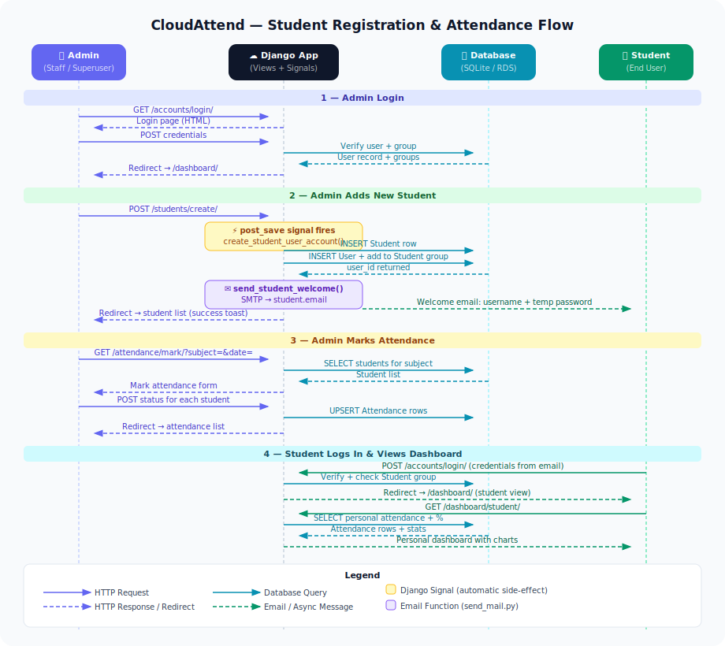

# CloudAttend — Cloud Attendance System

> A cloud-based student attendance management system built with **Django 5** (Python 3.12),
> deployable to **AWS Elastic Beanstalk + Aurora Serverless v2** via a single **CloudFormation** stack,
> with automated CI/CD via **GitHub Actions**.

---

## Table of Contents

1. [Features](#features)
2. [Tech Stack](#tech-stack)
3. [Architecture](#architecture)
4. [System Flow Diagram](#system-flow-diagram)
5. [Project Structure](#project-structure)
6. [Local Development](#local-development)
7. [Environment Variables](#environment-variables)
8. [GitHub Actions CI/CD](#github-actions-cicd)
9. [Post-Deployment Steps](#post-deployment-steps)
11. [Using the Admin Portal](#using-the-admin-portal)
12. [Using the Student Portal](#using-the-student-portal)
13. [Email Notifications](#email-notifications)
14. [REST API Reference](#rest-api-reference)
15. [Developer](#developer)

---

## Features

| Feature | Description |
|---------|-------------|
| **Role-based dashboards** | Separate views for Admin/Staff and Students |
| **Bulk attendance marking** | Mark an entire class in one screen with P / A / L / E toggles |
| **Analytics dashboard** | Weekly bar chart + status doughnut (Chart.js) |
| **Per-student reports** | Attendance % per student, filterable by subject & date range |
| **Department management** | Group students and subjects by department |
| **Student auto-accounts** | Django login account created automatically on enrollment |
| **Welcome email** | Credentials emailed to student on registration via any SMTP provider |
| **REST API v1** | Full CRUD over students, attendance, subjects, departments |
| **Light UI** | White cards, dark sidebar, indigo accents, animated stats, Inter font |
| **WhiteNoise static files** | Static assets served with compression — no S3 needed for static |
| **Aurora Serverless v2** | Auto-scales from 0.5 ACU — pay only for what you use |
| **GitHub Actions CI/CD** | Push to `main` → automatic CloudFormation + EB deployment |

---

## Tech Stack

| Layer | Technology |
|-------|-----------|
| Language | Python 3.12 |
| Framework | Django 5.0, Django REST Framework 3.15 |
| Database (local) | SQLite 3 |
| Database (cloud) | **Aurora Serverless v2** (MySQL 8.0 compatible) |
| Deployment | AWS Elastic Beanstalk (Amazon Linux 2023, Python 3.12) |
| IaC | AWS CloudFormation |
| CI/CD | GitHub Actions |
| Static files | WhiteNoise |
| Email | Django SMTP (Gmail / Mailgun / SendGrid free tier) |
| Frontend | Bootstrap 5.3, Chart.js 4, Font Awesome 6, Inter (Google Fonts) |

---

## Architecture



The CloudFormation stack provisions:
- **VPC** (10.0.0.0/16) with public subnets (EB) and private subnets (Aurora) across 2 AZs
- **Internet Gateway** + public route tables
- **Security groups** (HTTP/HTTPS → EB; MySQL port 3306 from EB only → Aurora)
- **Aurora Serverless v2** in private subnets — auto-scales 0.5–4 ACUs, encrypted, 7-day backups
- **IAM roles** for EB instance and EB service
- **Elastic Beanstalk** environment wired to Aurora via environment variables

> **Why Aurora Serverless v2?** Unlike provisioned RDS, Aurora Serverless v2 scales instantly
> to zero cost when idle (great for dev/staging) and scales up in <1 s under load for production —
> no instance type selection, no over-provisioning.

---

## System Flow Diagram

The diagram below shows the complete flow — from admin login, adding a new student (with automatic account creation and welcome email), through marking attendance, to a student logging in and viewing their personal dashboard.



### What happens when an admin adds a student

```
Admin submits form
      │
      ▼
Django view saves Student record
      │
      ├──► Django post_save signal fires automatically
      │          │
      │          ├──► Creates Django User account
      │          │    (username = student_id, password = Student@<last4>)
      │          │
      │          ├──► Adds user to 'Student' auth group
      │          │
      │          └──► Sends welcome email with credentials
      │                    (via configured SMTP provider)
      │
      └──► Admin redirected to student list with success message
```

---

## Project Structure

```
Cloud_Attendance_System/
├── .github/
│   └── workflows/
│       └── deploy.yml          # GitHub Actions CI/CD pipeline
│
├── Attendance_System/          # Django project config
│   ├── settings.py             # All settings; loads .env; auto-detects Aurora vs SQLite
│   ├── urls.py
│   └── wsgi.py
│
├── api_v1/                     # Main Django app
│   ├── models.py               # Department, Student, Subject, Attendance
│   ├── views.py                # Dashboard, CRUD, bulk-mark, reports, API
│   ├── urls.py                 # All URL patterns (web + REST API)
│   ├── serializers.py          # DRF serializers
│   ├── forms.py                # ModelForms for all CRUD pages
│   ├── admin.py                # Django admin registration
│   ├── signals.py              # Auto-creates User account on Student save
│   ├── send_mail.py            # Email helpers (SMTP, any provider)
│   ├── context_processors.py   # Exposes user_is_student to all templates
│   └── migrations/
│
├── templates/
│   ├── base.html               # Sidebar layout, topbar, toast system
│   ├── registration/login.html # Split-screen login page
│   ├── dashboard/
│   │   ├── admin.html          # Stats cards + Chart.js charts
│   │   └── student.html        # Personal attendance dashboard
│   ├── students/               # list, form, detail, confirm_delete
│   ├── attendance/             # list, mark (bulk), form, confirm_delete
│   ├── subjects/               # list, form
│   ├── departments/            # list, form
│   └── reports/index.html      # Per-subject attendance report
│
├── static/
│   ├── css/style.css           # Light-theme design system
│   └── js/main.js              # Sidebar toggle, count-up, status toggles
│
├── docs/
│   ├── architecture.png        # AWS architecture diagram (Pillow-generated)
│   ├── flow-diagram.svg        # Student registration sequence diagram
│   └── generate_diagram.py     # Script to regenerate architecture.png
│
├── cloudformation/
│   └── template.yaml           # CloudFormation stack (VPC + Aurora Serverless v2 + EB)
│
├── .ebextensions/
│   └── django.config           # EB hooks: migrate + collectstatic on deploy
│
├── .env                        # Local environment variables (gitignored)
├── .env.example                # Safe template to commit
├── requirements.txt
├── manage.py
└── SETUP.md                    # Quick-start cheatsheet
```

---

## Local Development

### Prerequisites

- Python 3.12+
- `pip`
- Git

### 1 — Clone and install dependencies

```bash
git clone https://github.com/kujalk/Cloud_Attendance_System.git
cd Cloud_Attendance_System

python -m venv venv
source venv/bin/activate        # Windows: venv\Scripts\activate

pip install -r requirements.txt
```

### 2 — Configure environment variables via `.env`

Copy the example file and fill in your values:

```bash
cp .env.example .env
```

Open `.env` in your editor. For local dev with SQLite and console email the defaults work out of the box — you only need to set email credentials if you want to test real email sending:

```ini
# .env (local dev — SQLite + console email, no changes needed)
SECRET_KEY=django-insecure-change-me-before-going-to-production
DEBUG=True
ALLOWED_HOSTS=*

# Leave RDS_* commented out → Django uses SQLite automatically

# Leave EMAIL_HOST commented out → emails print to terminal console
```

To test real email sending locally, set `EMAIL_HOST` and add your credentials (see [Email Notifications](#email-notifications)).

### 3 — Apply database migrations

```bash
python manage.py migrate
```

### 4 — Create the Student group

```bash
python manage.py shell -c "
from django.contrib.auth.models import Group
Group.objects.get_or_create(name='Student')
print('Student group created.')
"
```

### 5 — Create an admin superuser

```bash
python manage.py createsuperuser
```

### 6 — (Optional) Load sample data

```bash
python manage.py shell -c "
from api_v1.models import Department, Subject, Student

dept, _ = Department.objects.get_or_create(name='Computer Science', code='CS')
sub, _ = Subject.objects.get_or_create(title='Data Structures', defaults={'department': dept, 'credits': 3})

s = Student.objects.create(
    first_name='Jane', last_name='Doe',
    email='jane@maildrop.cc',   # use maildrop.cc for instant throwaway inbox
    mobile_no='0001234567',
    department=dept, roll_number='CS-001'
)
print(f'Student login: username={s.student_id[:30]}, password=Student@{s.student_id[-4:]}')
"
```

> **Tip:** Use [maildrop.cc](https://maildrop.cc) for disposable student email addresses during testing.
> Any email sent to `anything@maildrop.cc` is instantly readable at `maildrop.cc/anything` — no sign-up needed.

### 7 — Run the development server

```bash
python manage.py runserver
```

Open [http://localhost:8000](http://localhost:8000) — redirects to login, then to the dashboard.

---

## Environment Variables

Settings are loaded in this priority order:
1. **OS environment variables** (highest — used by Elastic Beanstalk)
2. **`.env` file** in the project root (local dev)
3. **In-code defaults** (lowest — safe fallbacks for local use)

### Application

| Variable | Default | Description |
|----------|---------|-------------|
| `SECRET_KEY` | Insecure dev key | Django secret key — generate a new one per deployment |
| `DEBUG` | `True` | Set to `False` in production |
| `ALLOWED_HOSTS` | `*` | Comma-separated hostnames, e.g. `.elasticbeanstalk.com` |

### Database (Aurora / RDS)

| Variable | Description |
|----------|-------------|
| `RDS_HOSTNAME` | Aurora cluster endpoint — presence switches Django to MySQL mode |
| `RDS_DB_NAME` | Database name |
| `RDS_USERNAME` | DB master username |
| `RDS_PASSWORD` | DB master password |
| `RDS_PORT` | DB port (`3306`) |

### Email (SMTP)

When `EMAIL_HOST` is absent, emails are printed to the console.

| Variable | Example | Description |
|----------|---------|-------------|
| `EMAIL_HOST` | `smtp.gmail.com` | SMTP server |
| `EMAIL_PORT` | `587` | SMTP port |
| `EMAIL_USE_TLS` | `True` | Enable STARTTLS |
| `EMAIL_HOST_USER` | `you@gmail.com` | SMTP username |
| `EMAIL_HOST_PASSWORD` | `app-password` | SMTP password / App Password |
| `DEFAULT_FROM_EMAIL` | `CloudAttend <you@gmail.com>` | From address |
| `ATTENDANCE_ADMIN_EMAILS` | `admin@school.edu` | CC'd on welcome emails |
| `SITE_URL` | `https://app.elasticbeanstalk.com` | Base URL in email links |

Generate a secure `SECRET_KEY`:

```bash
python -c "import secrets; print(secrets.token_urlsafe(50))"
```

---

## GitHub Actions CI/CD

Deployment is **fully automated** — push to `main` and the workflow handles everything from zero.

### How it works

The workflow at [`.github/workflows/deploy.yml`](.github/workflows/deploy.yml) runs as a single job:

```
Push to main
    │
    ├─ 1. Probe existing resources
    │       checks CF stack status, EB app + env existence
    │       auto-detects EB platform if EB_PLATFORM secret not set
    │
    ├─ 2. CloudFormation deploy (create or update — idempotent)
    │       first run  → creates VPC + Aurora Serverless v2 + EB app + EB env
    │       later runs → updates only what changed (no-op if nothing changed)
    │       ROLLBACK_COMPLETE stack → auto-deleted and recreated
    │
    ├─ 3. Package Django app (zip, secrets + DB excluded)
    │
    ├─ 4. S3 bucket (auto-created if absent, versioning enabled)
    │
    ├─ 5. EB application version (tagged with timestamp + commit SHA)
    │
    ├─ 6. EB environment deploy
    │       env exists  → update-environment with new version
    │       env absent  → uses the CF-created environment
    │
    ├─ 7. Wait for environment status = Ready
    │
    ├─ 8. Push email secrets to EB (only if EMAIL_HOST secret is set)
    │
    └─ 9. Print App URL + Aurora endpoint to job summary
```

### Setup: add GitHub Secrets

Go to **Settings → Secrets and variables → Actions → New repository secret**:

| Secret | Example | Required |
|--------|---------|----------|
| `AWS_ACCESS_KEY_ID` | `AKIA...` | **Yes** |
| `AWS_SECRET_ACCESS_KEY` | `wJalr...` | **Yes** |
| `AWS_REGION` | `us-east-1` | **Yes** |
| `DB_PASSWORD` | `MySecure123!` | **Yes** |
| `DJANGO_SECRET_KEY` | `python -c "import secrets; print(secrets.token_urlsafe(50))"` | **Yes** |
| `EB_PLATFORM` | `64bit Amazon Linux 2023 v4.3.0 running Python 3.12` | No — auto-detected if absent |
| `EMAIL_HOST` | `smtp.gmail.com` | No |
| `EMAIL_PORT` | `587` | No |
| `EMAIL_USE_TLS` | `True` | No |
| `EMAIL_HOST_USER` | `you@gmail.com` | No |
| `EMAIL_HOST_PASSWORD` | `xxxx-xxxx-xxxx-xxxx` | No |
| `DEFAULT_FROM_EMAIL` | `CloudAttend <you@gmail.com>` | No |
| `ATTENDANCE_ADMIN_EMAILS` | `admin@school.edu` | No |
| `SITE_URL` | `https://yourapp.elasticbeanstalk.com` | No |

### Setup: create IAM user for GitHub Actions

Create a dedicated IAM user (**never use root credentials**) with these managed policies:

| Policy | Why |
|--------|-----|
| `AWSElasticBeanstalkFullAccess` | Create/update EB app + env + versions |
| `AWSCloudFormationFullAccess` | Deploy the CF stack |
| `AmazonRDSFullAccess` | Aurora cluster provisioning via CF |
| `AmazonS3FullAccess` | Create deployment bucket, upload bundles |
| `IAMFullAccess` | CF creates IAM roles on your behalf |
| `AmazonVPCFullAccess` | CF creates VPC, subnets, security groups |
| `AmazonEC2FullAccess` | CF creates EC2 security groups |

### First deployment

Once secrets are configured, just push to `main`:

```bash
git push origin main
```

Watch the workflow run in **Actions** tab. Aurora provisioning takes ~10 minutes on the first run — subsequent pushes deploy in ~3–4 minutes.

### Manual trigger (selective deploy)

**Actions → Deploy to AWS → Run workflow** → choose scope:

| Scope | What runs |
|-------|-----------|
| `all` | CloudFormation + EB app deploy (default) |
| `infra-only` | CloudFormation stack only (no app deploy) |
| `app-only` | EB app version only (stack must already exist) |

### Tearing down

Use the **Destroy** workflow — no CLI required:

1. Go to **Actions → Destroy AWS Stack → Run workflow**
2. Type `DELETE` in the confirmation box
3. Choose whether to also delete the Aurora snapshot
4. Click **Run workflow**

The workflow ([`.github/workflows/destroy.yml`](.github/workflows/destroy.yml)) will:
- Terminate all EB environments
- Delete all EB application versions
- Delete the CloudFormation stack (VPC, Aurora, EB, IAM, security groups)
- Empty and delete the S3 deployment bucket (including all versioned objects)
- Optionally delete the Aurora final snapshot
- Print a verification table in the job summary

> Aurora is always deleted with a final snapshot unless you explicitly select **Delete Aurora snapshot = yes**.
> The snapshot is retained in the RDS console under *Manual snapshots* for data recovery.

---

## Post-Deployment Steps

The workflow handles migrations and static files automatically (via `.ebextensions/django.config`).

The **only manual step** is creating the first admin superuser. Do this once after the first successful deployment:

```bash
# Install the EB CLI
pip install awsebcli

# Initialise (run from the project root)
eb init CloudAttendanceSystem --region us-east-1 --platform "Python 3.12"

# SSH into the running instance
eb ssh

# --- Inside the instance ---
source /var/app/venv/*/bin/activate
cd /var/app/current

# Create admin account
python manage.py createsuperuser

# Create the Student auth group (required for student login)
python manage.py shell -c "
from django.contrib.auth.models import Group
Group.objects.get_or_create(name='Student')
print('Done.')
"
```

After this the app is fully operational. All future code changes deploy automatically on `git push`.

---

## Using the Admin Portal

Admin/Staff users have full control over all data in the system.

### Logging In

1. Open the application URL in your browser.
2. You will be redirected to `/accounts/login/`.
3. Enter your **username** and **password** (the superuser you created).
4. You are taken to the **Admin Dashboard** showing live statistics.

### Dashboard Overview

- **Total Students**, **Present Today**, **Absent Today**, **Late Today**
- **Total Subjects** and **Departments**
- **Weekly Attendance Trend** bar chart (last 7 days)
- **Status Breakdown** doughnut chart (all time)
- **Subject Attendance** table with progress bars
- **Recent Activity** — last 20 attendance entries

### Managing Departments

1. Click **Departments** → **Add Department** (e.g. *Computer Science, CS*).

### Managing Subjects

1. Click **Subjects** → **Add Subject** — enter title, department, credit hours.

### Managing Students

1. Click **Students** → **Add Student** — fill in name, email, mobile, department, roll number.
2. **On save**, Django automatically:
   - Creates a login account (`Student@<last4-of-UUID>` as password)
   - Adds user to the `Student` group
   - Sends a welcome email with credentials

> **Test emails:** Use [maildrop.cc](https://maildrop.cc) for student emails during testing.
> E.g. set a student's email to `jane.cs001@maildrop.cc` and read it instantly at
> `maildrop.cc/jane.cs001` — no registration, no spam filters.

### Marking Attendance

1. Click **Mark Attendance** → select **Subject** and **Date** → **Load Students**.
2. Click status badges to cycle: 🟢 **P** → 🔴 **A** → 🟡 **L** → 🔵 **E**.
3. Click **Save Attendance** — re-saving updates existing records.

### Reports

Click **Reports** → select subject and date range → view per-student attendance percentages.

### Logging Out

Click the **→⊣ Sign Out** button at the bottom of the sidebar or in the top-right corner.

---

## Using the Student Portal

### Receiving Your Credentials

When an admin registers you, you receive a welcome email containing:
- The application URL
- Your **username** (Student ID)
- Your **temporary password** (`Student@xxxx`)

> If no email arrives, ask your admin for your credentials, or use [maildrop.cc](https://maildrop.cc) if your email address was set to a maildrop.cc address.

### Student Dashboard

Your dashboard shows:
- Your overall attendance percentage
- Present / Absent / Late / Excused counts
- Per-subject breakdown with attendance rates
- Recent attendance log (last 10 records)

The dashboard is **read-only** — only admins can mark or edit attendance.

### Logging Out

Click the **→⊣ Sign Out** button at the bottom of the sidebar or in the top-right corner.

---

## Email Notifications

### Development — console output (default)

Without `EMAIL_HOST` set in `.env`, emails are printed to the terminal:

```
Subject: Welcome to Cloud Attendance System — Your Login Details
To: jane@maildrop.cc
...
```

### Maildrop.cc — zero-setup disposable inboxes (recommended for testing)

Use [maildrop.cc](https://maildrop.cc) email addresses for student accounts when testing.

| Step | Action |
|------|--------|
| Set student email | `anything@maildrop.cc` (e.g. `jane.test@maildrop.cc`) |
| Read the inbox | Visit `https://maildrop.cc/jane.test` — no login, instant |
| Delete inbox | Just stop using it — auto-expires |

This way you can test the full welcome email flow without configuring SMTP at all.

### Gmail (recommended for production)

1. Enable 2-Step Verification on your Google account.
2. Create an App Password: [myaccount.google.com/apppasswords](https://myaccount.google.com/apppasswords)
   → Select app: **Mail** → Select device: **Other** → name it `CloudAttend` → copy the 16-char password.
3. Set in `.env`:

```ini
EMAIL_HOST=smtp.gmail.com
EMAIL_PORT=587
EMAIL_USE_TLS=True
EMAIL_HOST_USER=your@gmail.com
EMAIL_HOST_PASSWORD=xxxx-xxxx-xxxx-xxxx   # App Password, NOT your Gmail password
DEFAULT_FROM_EMAIL=CloudAttend <your@gmail.com>
SITE_URL=http://localhost:8000
```

### Other free SMTP providers

| Provider | Free tier | `EMAIL_HOST` |
|----------|-----------|--------------|
| **Mailgun** | 1,000 emails/month | `smtp.mailgun.org` |
| **SendGrid** | 100 emails/day | `smtp.sendgrid.net` |
| **Outlook/Hotmail** | Free with account | `smtp.office365.com` |
| **Mailtrap** | 1,000 emails/month (dev-only) | `live.smtp.mailtrap.io` |

---

## REST API Reference

Obtain a token:

```bash
curl -X POST http://<host>/api-token-auth/ \
  -H "Content-Type: application/json" \
  -d '{"username": "admin", "password": "your-password"}'
```

```bash
curl http://<host>/api/v1/students/ -H "Authorization: Token <your-token>"
```

| Method | Endpoint | Description |
|--------|----------|-------------|
| GET, POST | `/api/v1/students/` | List / create students |
| GET, PATCH, DELETE | `/api/v1/students/<id>/` | Retrieve / update / delete student |
| GET, POST | `/api/v1/attendance/` | List / create records |
| GET, PATCH, DELETE | `/api/v1/attendance/<id>/` | Retrieve / update / delete record |
| GET, POST | `/api/v1/subjects/` | List / create subjects |
| GET, POST | `/api/v1/departments/` | List / create departments |
| GET, POST | `/api/v1/enrollments/` | List / create enrolments |

All list endpoints are **paginated** (20 per page). Append `?page=2` for subsequent pages.

---

## Developer

**K. Janarthanan**
- Blog: [scripting4ever.wordpress.com](https://scripting4ever.wordpress.com/2021/03/23/different-views-based-on-users-privileges-in-django-application/)
- GitHub: [github.com/kujalk](https://github.com/kujalk)

---

*Enhanced to Python 3.12 / Django 5.0 with Aurora Serverless v2, GitHub Actions CI/CD, bulk attendance marking, analytics dashboards, role-based portals, SMTP email notifications, and a complete UI overhaul.*
